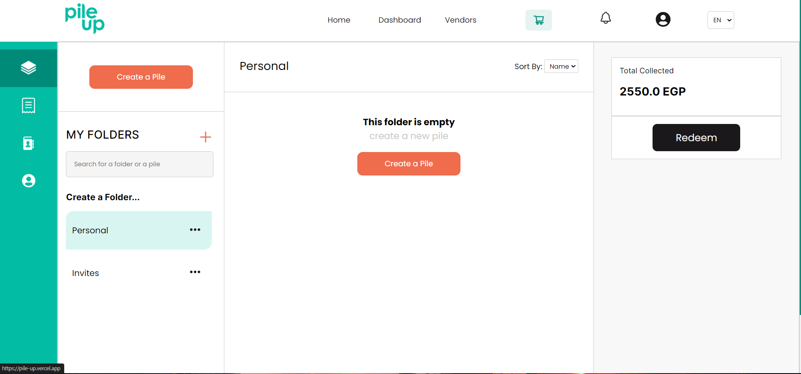

<!-- PROJECT LOGO -->
 

  

<h1 align="center">Pile Up</h1>

    A crowdfunding platform revolutionizing the way people support causes and projects 💡
  

  

    <a href="https://pile-up.vercel.app/"><strong>Visit Pile Up Website »</strong></a>
  

<!-- TABLE OF CONTENTS -->

  
Table of Contents

  <ul>
    <li><a href="#about-the-project">About</a></li>
    <li><a href="#built-with">Built With</a></li>
    <li><a href="#roadmap">Road Map</a></li>
    <li><a href="#contact-me">Contact Me</a></li>
  </ul>

<!-- ABOUT THE PROJECT -->
## About The Project

### Feature Overview
Pile Up is a crowdfunding platform that enables users to create Piles, each comprising various funding goals and items. Contributors can donate funds to help achieve these goals and obtain the items within the Piles.

    
    
    

### User Dashboard
Users have access to a personalized dashboard displaying an overview of their Piles, contributions, and invitations. The platform incorporates authentication, a cart system, and a feature for inviting friends to join Piles.

(<a href="#readme-top">back to top</a>)

## Built With
![HTML5][html-shield]
![JavaScript][js-shield]
![CSS][css-shield]
![React][react-shield]
![Laravel][laravel-shield]

Pile Up is a full-stack application built using React with hooks on the frontend, Laravel on the backend, and JavaScript and CSS for styling.

(<a href="#readme-top">back to top</a>)

<!-- ROADMAP -->
## Roadmap

- Enhance Authentication Options
    - Integrate multiple social media authentication methods (e.g., Google, Facebook, Twitter)
    - Improve overall security measures for user authentication

- Revamp Invitation System
    - Strengthen the invitation system with robust features
    - Enable users to send invitations via various channels, including email and social media
    - Implement a tracking system to monitor the status of sent invitations
    - Enhance user experience with customizable invitation messages and visuals

<!-- See the [open issues](https://github.com/github_username/repo_name/issues) for a full list of proposed features (and known issues). -->

(<a href="#readme-top">back to top</a>)

<!-- CONTACT -->
## Contact Me

View my Portfolio: [![portfolio][portfolio-shield]][portfolio-url]

Shoot me an Email: Thisisahmedhamdy@gmail.com

Find me on Twitter: [![twitter][twitter-shield]][twitter-url]

Connect on Linked In: [![linkedIn][linkedin-shield]][linkedin-url]

(<a href="#readme-top">back to top</a>)

<!-- MARKDOWN LINKS & IMAGES -->
<!-- https://www.markdownguide.org/basic-syntax/#reference-style-links -->
[html-shield]: https://img.shields.io/badge/html5-%23E34F26.svg?style=for-the-badge&logo=html5&logoColor=white

[react-shield]: https://img.shields.io/badge/React-%2361DAFB.svg?style=for-the-badge&logo=react&logoColor=white

[node-shield]: https://img.shields.io/badge/Node.js-6DA55F?style=for-the-badge&logo=node.js&logoColor=white
[laravel-shield]: https://img.shields.io/badge/Laravel-%23FF2D20.svg?style=for-the-badge&logo=laravel&logoColor=white

[js-shield]: https://img.shields.io/badge/javascript-%23323330.svg?style=for-the-badge&logo=javascript&logoColor=%23F7DF1E

[css-shield]: https://img.shields.io/badge/CSS-1572B6?style=for-the-badge&logo=css3&logoColor=white

[portfolio-shield]:https://img.shields.io/badge/PORTFOLIO-100000?style=for-the-badge&logo=Portfolio&logoColor=white&labelColor=FFFDFC&color=C77D4F
[portfolio-url]: https://ahmedhhamdy.vercel.app/

[linkedin-shield]: https://img.shields.io/badge/linkedin-%230077B5.svg?style=for-the-badge&logo=linkedin&logoColor=white
[linkedin-url]: https://www.linkedin.com/in/ahmed-hamdy-a71a28181/

[twitter-shield]: https://img.shields.io/badge/@your-twitter-%231DA1F2.svg?style=for-the-badge&logo=Twitter&logoColor=white
[twitter-url]: https://twitter.com/AhmedHHamdyx
